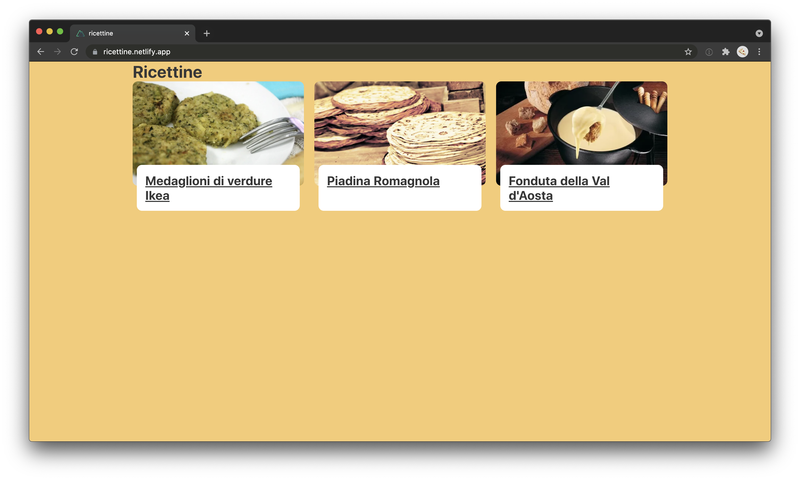

# Recipes (⚠️ WIP)

This project is a place to save the recipes that I have tried and liked. Here I can also write in the CMS the changes to the recipes I have made.

| \                | \                                                                                                                                                              |
|------------------|----------------------------------------------------------------------------------------------------------------------------------------------------------------|
| Pipeline         | [](https://app.netlify.com/sites/ricettine/deploys) |
| Deploy preview   | https://ricettine.netlify.app/                                                                                                                                 |
| Project typology | Personal                                                                                                                                                       |




## 🔥 Tech stack

| Purpose               | Technology   |
|:----------------------|:-------------|
| Templating            | VueJS        |
| Styling               | SCSS + BEMIT |
| Documentation         | Markdown     |
| Server Side Rendering | NuxtJS       |

## 🌊 Run development mode

```shell
# install dependencies
npm i

# serve with hot reload at localhost:8080
npm run dev
```

## 🧳 Build setup

Build for production and launch server

```shell
# build for production and launch server
npm run build
npm run start

# generate static project
npm run generate
```

### 🌿 Branches

| Branch name | Use        |
|:------------|:-----------|
| `main`      | production |
